# Linux Network

1. [Инструмент ipcalc](#part-1-инструмент-ipcalc)
2. [Статическая маршрутизация между двумя машинами](#part-2-статическая-маршрутизация-между-двумя-машинами)
3. [Утилита iperf3](#part-3-утилита-iperf3)
4. [Сетевой экран](#part-4-сетевой-экран)
5. [Статическая маршрутизация сети](#part-5-статическая-маршрутизация-сети)
6. [Динамическая настройка IP с помощью DHCP](#part-6-динамическая-настройка-ip-с-помощью-dhcp)
7. [NAT](#part-7-nat)
8. [Допополнительно. Знакомство с SSH Tunnels](#part-8-дополнительно-знакомство-с-ssh-tunnels)

## Part 1. Инструмент ipcalc

Устанавливаем инструмент ipcalc(sudo apt install ipcalc)

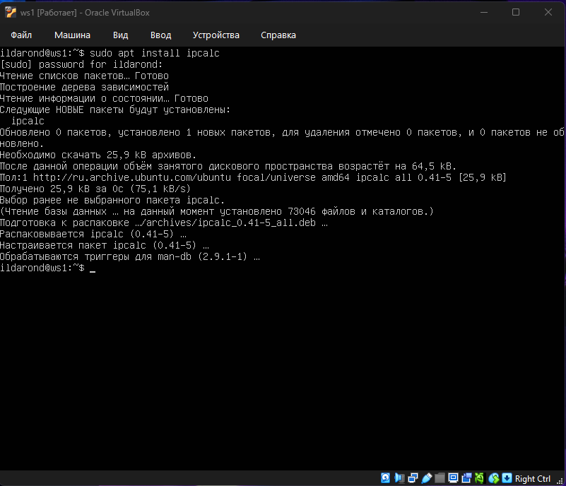

1.1. Сети и маски

Определить и записать в отчёт:
1) адрес сети *192.167.38.54/13*

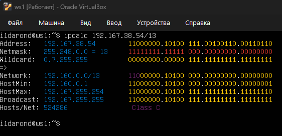

2) перевод маски *255.255.255.0* в префиксную и двоичную запись, */15* в обычную и двоичную, *11111111.11111111.11111111.11110000* в обычную и префиксную

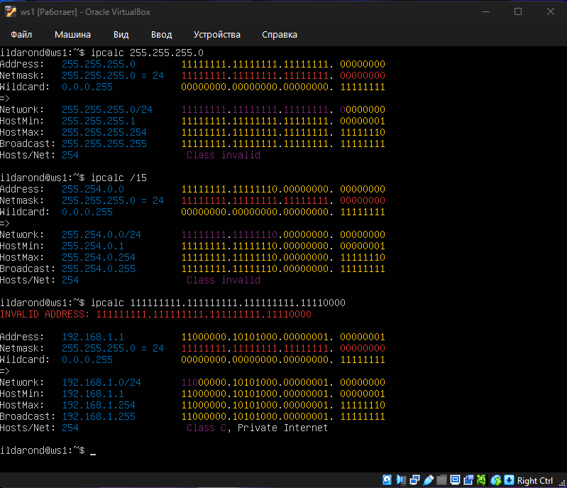

3) минимальный и максимальный хост в сети *12.167.38.4* при масках: 
   * */8* 
      * Минимальный хост - 12.0.0.1
      * Максимальный хост - 12.255.255.254
   * *11111111.11111111.00000000.00000000*,
   * *255.255.254.0*
      * Минимальный хост - 12.167.38.1
      * Максимальный хост - 12.167.39.254
   * */4*
      * Минимальный хост - 0.0.0.1
      * Максимальный хост - 15.255.255.254

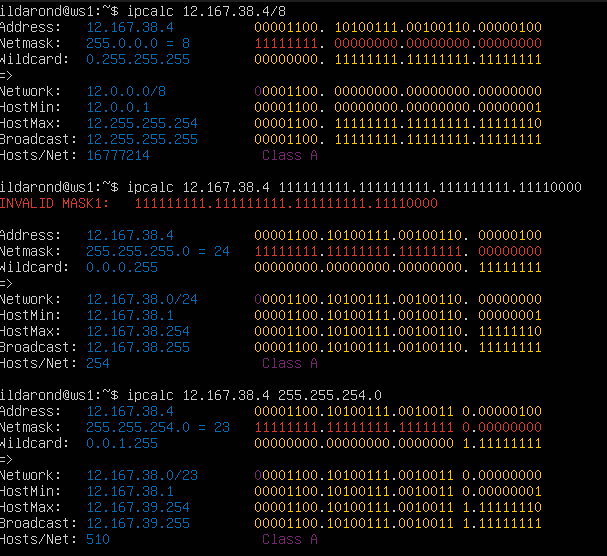

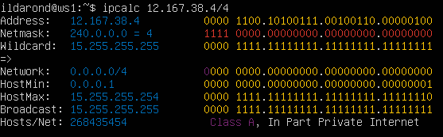

1.2. localhost
Определить и записать в отчёт, можно ли обратиться к приложению, работающему на localhost, со следующими IP: *194.34.23.100*, *127.0.0.2*, *127.1.0.1*, *128.0.0.1*

Localhost – это имя хоста, которое относится к компьютерной системе, на которой запущена вызывающая программа, что означает, что машина будет разговаривать сама с собой, когда мы вызываем localhost.

При использовании “localhost” доступ к сетевым службам осуществляется через логический сетевой интерфейс, называемый loopback. IP-адрес интерфейса loopback – 127.0.0.1.

Согласно стандартам IETF для адресации IPv4, весь блок 127.0.0.0/8 выделен для целей loopback.

   * 194.34.23.100 - нет
   * 127.0.0.2 - да
   * 127.1.0.1 - да
   * 128.0.0.1 - нет

Проверить можно пропинговав адреса:

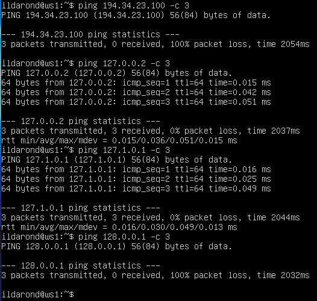

Либо через ipcalc:

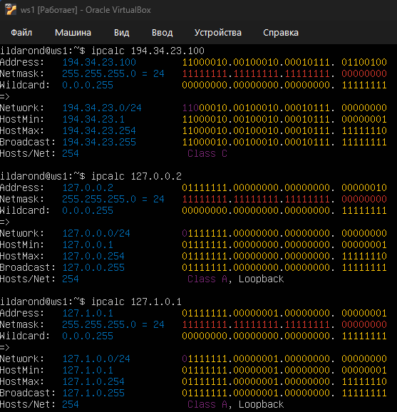

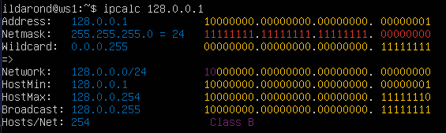

1.3. Диапазоны и сегменты сетей
Определить и записать в отчёт:
1) какие из перечисленных IP можно использовать в качестве публичного, а какие только в качестве частных: *10.0.0.45*, *134.43.0.2*, *192.168.4.2*, *172.20.250.4*, *172.0.2.1*, *192.172.0.1*, *172.68.0.2*, *172.16.255.255*, *10.10.10.10*, *192.169.168.1*

**К частным "серым" адресам относятся** IP-адреса из следующих подсетей: 
* От 10.0.0.0 до 10.255.255.255 с маской 255.0.0.0 или /8 
* От 172.16.0.0 до 172.31.255.255 с маской 255.240.0.0 или /12 
* От 192.168.0.0 до 192.168.255.255 с маской 255.255.0.0 или /16 
* От 100.64.0.0 до 100.127.255.255 с маской подсети 255.192.0.0 или /10

Это зарезервированные IP-адреса. Такие адреса предназначены для применения в закрытых локальных сетях, распределение таких адресов никем не контролируется.

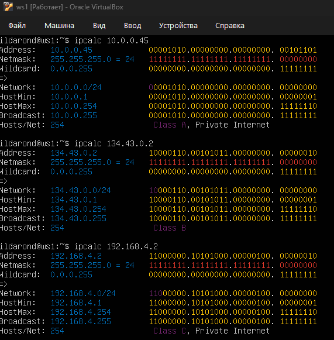

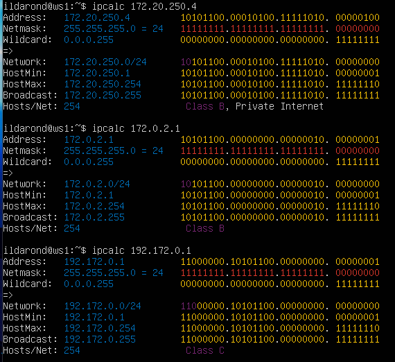

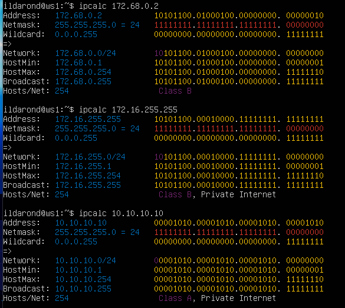

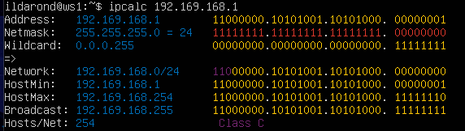

<table whidth = "50%" border = "2">
<col>
<col text-align="justify">
<th> ip адрес </th>
<th> Тип сети </th>
<tr>
  <td> 10.0.0.45
  <td> Частная 
<tr>
  <td> 134.45.0.2
  <td> Публичная
<tr>
  <td> 192.168.4.2
  <td> Частная
<tr> 
  <td> 172.20.250.4
  <td> Частная
<tr> 
  <td> 172.0.2.1
  <td> Публичная 
<tr>
  <td> 192.172.0.1
  <td> Публичная
<tr>
  <td> 172.68.0.2
  <td> Публичная
<tr>
  <td> 172.16.255.255
  <td> Частная
<tr>
  <td> 10.10.10.10
  <td> Частная
<tr>
  <td> 192.169.168.1
  <td> Публичная
</table>

Надпись "Private Internet" в строке "Hosts/Net" говорит о том, что ip адрес принадлежит частной сети.

2) какие из перечисленных IP адресов шлюза возможны у сети *10.10.0.0/18*: *10.0.0.1*, *10.10.0.2*, *10.10.10.10*, *10.10.100.1*, *10.10.1.255*

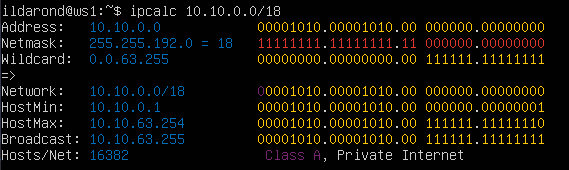

Диапазон возможных IP-адресов: 10.10.0.1 - 10.10.63.254

Таким образом, возможные: 10.10.0.2, 10.10.10.10, 10.10.1.255

## Part 2. Статическая маршрутизация между двумя машинами

2.1 Поднять две виртуальные машины (далее -- ws1 и ws2)

* `$ ip a` - посмотреть существующие сетевые интерфейсы

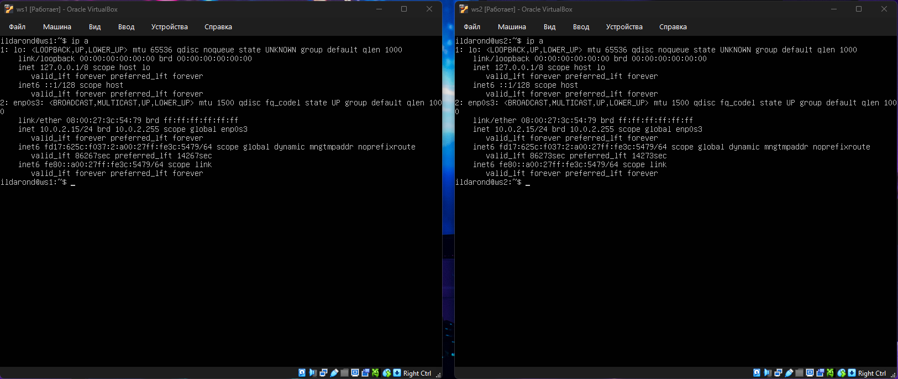

Описать сетевой интерфейс, соответствующий внутренней сети, на обеих машинах и задать следующие адреса и маски: ws1 - *192.168.100.10*, маска */16*, ws2 - *172.24.116.8*, маска */12*

* `$ sudo vim /etc/netplan/00-installer-config.yaml` - Сетевые интерфейсы в Ubuntu 20.04 настраиваются в файлах NetPlan YAML, которые хранятся в файлах /etc/netplan. Сетевые интерфейсы файлов по умолчанию для новой установки Ubuntu 20.04

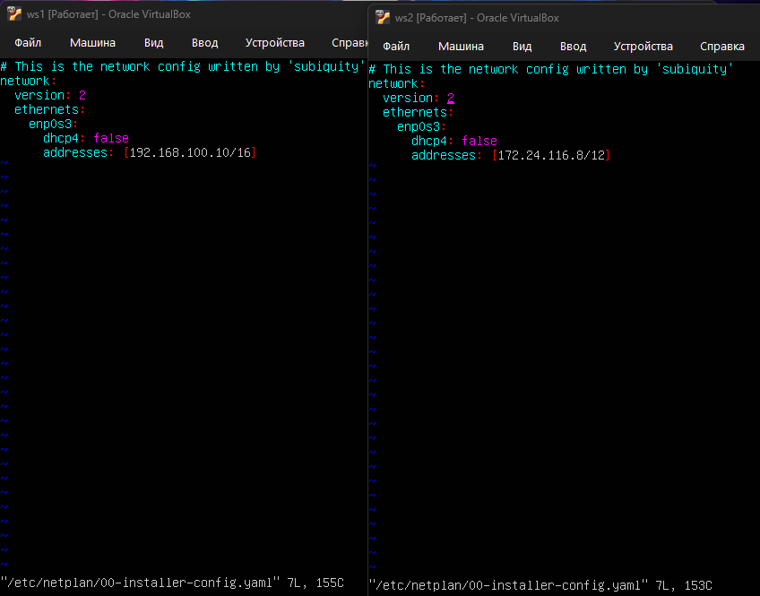


* `$ sudo netplan apply` - для перезапуска сервиса сети

2.1. Добавление статического маршрута вручную

* `$ sudo ip addr show` - информация о сетевых интерфейсах. 
* `$ ip -c a` - используется для отображения сетевых интерфейсов и их конфигураций. Она показывает IP-адреса, MAC-адреса и другие соответствующие детали всех доступных сетевых интерфейсов в системе.
* `$ ip route s` - просмотреть настроенные в данный момент маршруты
* Добавить статический маршрут от одной машины до другой.   
`sudo ip r add 172.24.116.8 dev enp0s3`  ws1   
`sudo ip r add 192.168.100.10 dev enp0s3` ws2  
* Пропинговать соединение между машинами.  
`sudo ping 172.24.116.8`   ws1   
`sudo ping 192.168.100.10`  ws2  

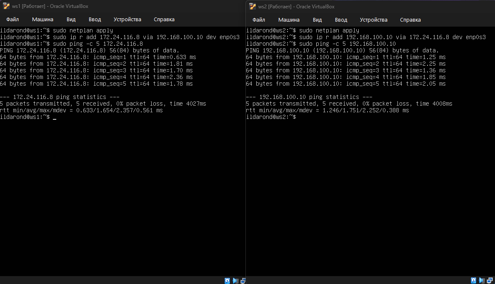


2.2. Добавление статического маршрута с сохранением
##### Перезапустить машины
* Добавить статический маршрут от одной машины до другой с помощью файла *etc/netplan/00-installer-config.yaml*   
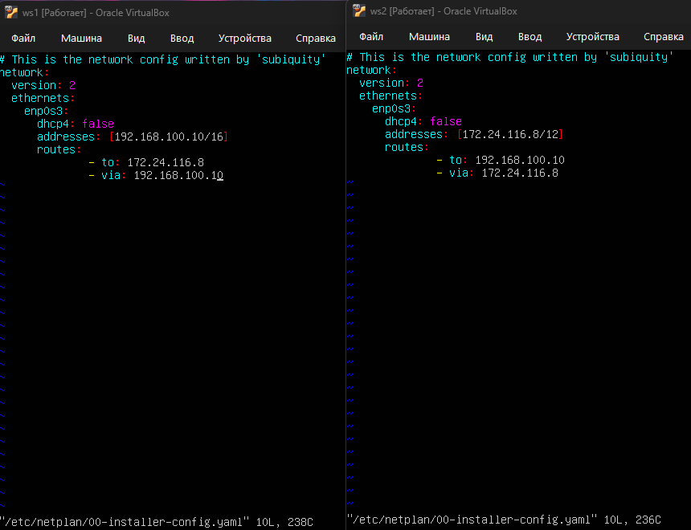

* sudo netplan apply 

* Пропинговать соединение между машинами  
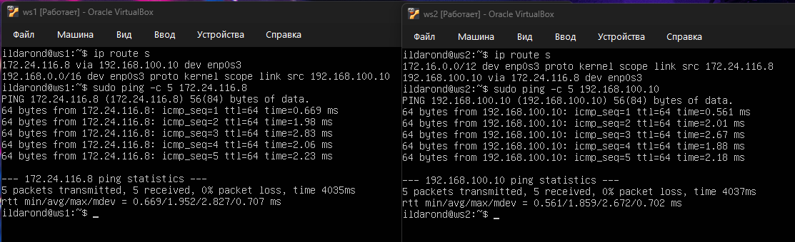

## Part 3. Утилита **iperf3**
3.1. Скорость соединения

<table whidth = "50%" border = "2">
<col>
<col text-align="justify">
<col>
<col>
<th> Единица </th>
<th> Перевод </th>
<th> Пояснение</th>
<tr>
  <td> 1 MB/s
  <td> 8 Mbps
  <td> 1 мегабайт в секунду равен 8 мегабит в секунду
<tr>
  <td> 1 MB/s
  <td> 1000 KB/c
  <td> 1 мегабайт в секунду равен 1000 килобайт в секунду
<tr>
  <td> 1 KB/c
  <td> 8 Kbps
  <td> 1 килобайт в секунду равен 8 килобит в секунду
<tr> 
  <td> 1 Kbps
  <td> 1000  bps
  <td> 1 килобит в секунду равен 1000 бит в секунду
<tr> 
  <td> 1 MB/s
  <td> 8000 Kbps
  <td> 1 мегабайт в секунду равен 8000 килобит в секунду
<tr>
  <td> 1 Gbps
  <td> 1000 Mbps
  <td> 1 гигабит в секунду равен 1000 мегабит в секунду
</table>

Переводим: 8 Mbps в MB/s, 100 MB/s в Kbps, 1 Gbps в Mbps
<table whidth = "50%" border = "2">
<th> Значение </th>
<th> Перевод </th>
<th> Примечание </th>
<tr>
  <td> 8 Mbps
  <td> 1 MB/s
  <td> 8 * 0,125
<tr> 
  <td> 100 MB/s
  <td> 800 000 Kbps
  <td> 100 * 8 * 1000
<tr>
  <td> 1 Gbps
  <td> 1000 Mbps
  <td> 1 * 1000
</table>

**В десятичной системе, которую используют производители жёстких дисков, SSD и некоторых сетевых устройств, единицы измеряются в десятичной системе, а не в двоичной**

3.2. Утилита **iperf3**

* `$ iperf3` - измеряет пропускную способность сети. Она поддерживает работу как по протоколу TCP, так и по UDP. Для проведения тестирования надо запустить iperf3 как на сервере, так и на клиенте. Клиентская часть будет генерировать трафик, а серверная - принимать и отбрасывать.
* `$ iperf3 -s` - запуск на сервере. Пока идет тестирование, придется держать iperf3 запущенным. Для удобства можно запустить утилиту в качестве демона командой: `iperf3 -s -D`

* Сначала необходимо запустить серверную часть программы. Для этого выполним на ws1 `$ iperf3 -s`. Таким образом, был запущен сервер с адресом 192.168.100.10   

* Подключимся к серверу с помощью `$ iperf3 -c 192.168.100.10` и получим информацию о скорости подключения (на ws2)
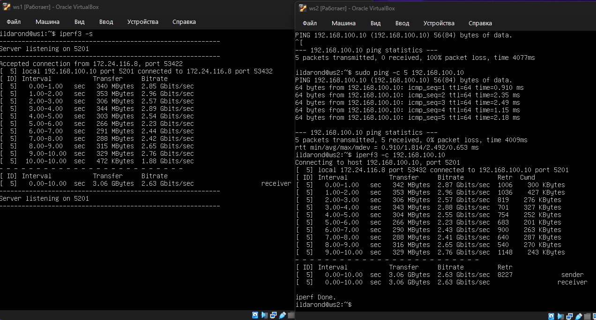
 
- Скорость передачи (bitrate) ws1: 2.63 Gbps (гигабит в секунду)
- Скорость передачи (bitrate) ws2: 2.63 Gbps (гигабит в секунду)

## Part 4. Сетевой экран

#### 4.1. Утилита **iptables**

##### Создать файл */etc/firewall.sh*, имитирующий фаерволл, на ws1 и ws2:
```shell
#!/bin/sh

# Удаление всех правил в таблице "filter" (по-умолчанию).
iptables –F
iptables -X
```
##### Нужно добавить в файл подряд следующие правила:
##### 1) на ws1 применить стратегию когда в начале пишется запрещающее правило, а в конце пишется разрешающее правило (это касается пунктов 4 и 5)
##### 2) на ws2 применить стратегию когда в начале пишется разрешающее правило, а в конце пишется запрещающее правило (это касается пунктов 4 и 5)
##### 3) открыть на машинах доступ для порта 22 (ssh) и порта 80 (http)
##### 4) запретить *echo reply* (машина не должна "пинговаться”, т.е. должна быть блокировка на OUTPUT)
##### 5) разрешить *echo reply* (машина должна "пинговаться")


*  `$ sudo nano /etc/firewall.sh` создаем файл имитирующий фаерволл и добавляем в него правила:   
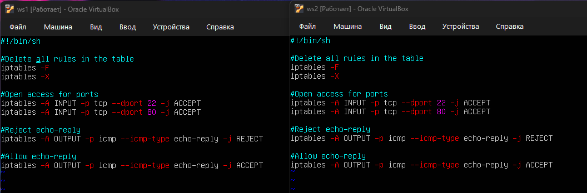
```shell
-F – очистить все правила;
-X – удалить цепочку;
-A – добавить правило в цепочку;
-p – вручную установить протокол (TCP, UDP, UDPLITE, ICMP, ICMPv6, ESP, AH, SCTP, MH);
--dport - указание номера порта
-j – выбрать действие при подтверждении правила.
--icmp-type - указание типа сообщения
```

* Запустить файлы на обеих машинах командами `chmod +x /etc/firewall.sh` и `/etc/firewall.sh`     
* iptables -L - как выполняется просмотр правил
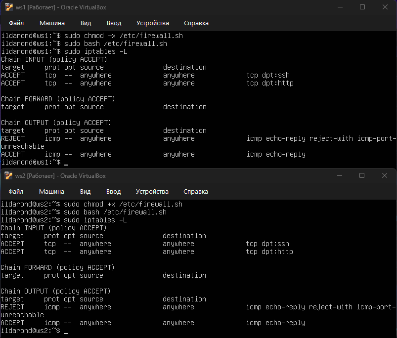

Правило `iptables -A OUTPUT -p icmp --icmp-type echo-reply -j DROP` блокирует исходящие ICMP пакеты типа "echo reply". Это означает, что если машина получила пинг (ICMP пакет типа "echo request") от другой машины, она не сможет отправить на него ответный пакет (ICMP пакет типа "echo reply").
Разница между стратегиями, применёнными в первом и втором файлах закобчаеися в том что на ws1 первым указано запрещающее правило на выход, поэтому она не сможет пропинговаться. 
У ws2, наоброт, а значит она сможет пропинговаттьcя.


#### 4.2. Утилита **nmap**

`nmap` - утилита для исследования сети и сканер портов

##### Командой **ping** найти машину, которая не "пингуется", после чего утилитой **nmap** показать, что хост машины запущен

* C ws1 на ws2 пингуется, с ws2 на ws1 не пингуется.    
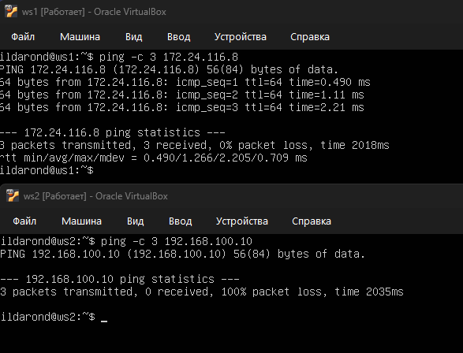

*Проверка: в выводе nmap должно быть сказано: `Host is up`*

* Устанавливаем утилиту nmap командой `$ sudo apt install nmap` и запускаем ее на ws1 и ws2 командой `$ sudo nmap \<IP-address>`    
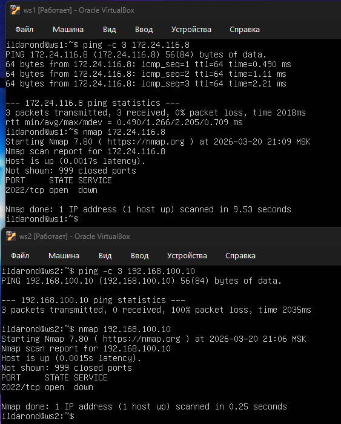

## Part 5. Статическая маршрутизация сети.

##### Поднять пять виртуальных машин (3 рабочие станции (ws11, ws21, ws22) и 2 роутера (r1, r2))

#### 5.1. Настройка адресов машин

* В настройках Virtualbox меняем типы соединения:

  * ws11, ws21, ws21:  
    Адаптер 1 - NAT   
    Адаптер 2 - Внутренняя сеть

  * r1, r2:    
    Адаптер1 - NAT    
    Адаптер 2 - Внутренняя сеть    
    Адаптер 3 - Внутренняя сеть

* Благодаря этому у машин появятся новые интерфейсы, которые можно настроить в соответствии со схемой.


##### Настроить конфигурации машин в *etc/netplan/00-installer-config.yaml* согласно сети на рисунке.
Cкрины по порядку: ws11, ws22, ws21, r2, r1

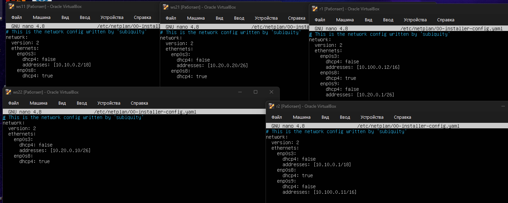

##### Перезапустить сервис сети. Если ошибок нет, то командой `ip -4 a` проверить, что адрес машины задан верно. Также пропинговать ws22 с ws21. Аналогично пропинговать r1 с ws11.

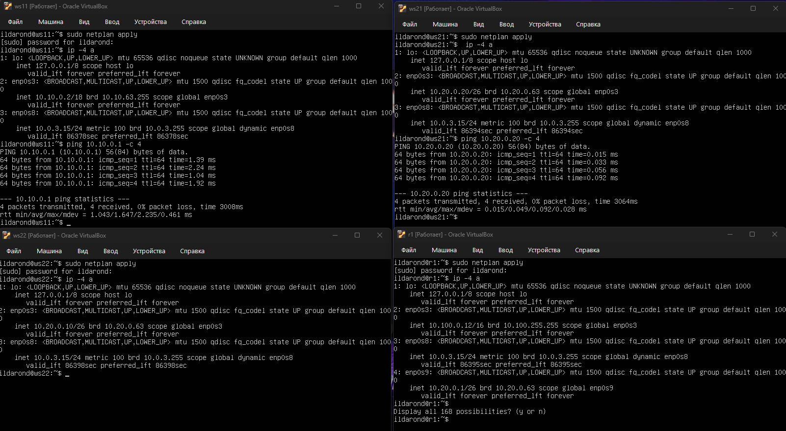
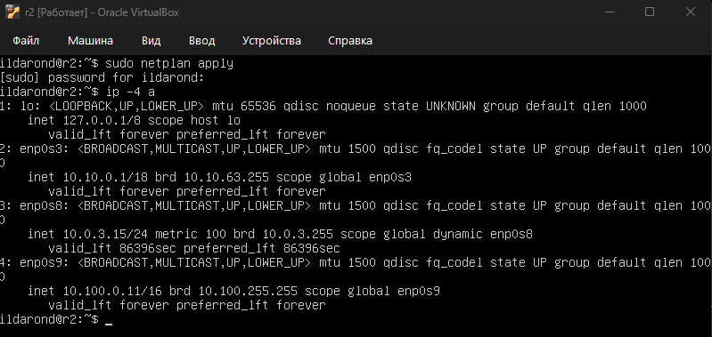

#### 5.2. Включение переадресации IP-адресов.
* `$ sudo sysctl -w net.ipv4.ip_forward=1` - Для включения переадресации IP, выполните команду на роутерах. При таком подходе переадресация не будет работать после перезагрузки системы.

Флаг "-w" означает "запись" (write). Он указывает утилите sysctl изменить значение параметра с помощью указанного варианта. В данном случае, значение "1" передается в параметр "net.ipv4.ip_forward", чтобы включить переадресацию IP-пакетов.

Параметр "net.ipv4.ip_forward" является параметром в системе Linux, который регулирует переадресацию IP-пакетов между сетевыми интерфейсами. Если значение этого параметра равно "1", то переадресация IP-пакетов включена, и Linux будет пересылать пакеты между различными сетевыми интерфейсами, что позволяет устройствам в разных сетях коммуницировать друг с другом.

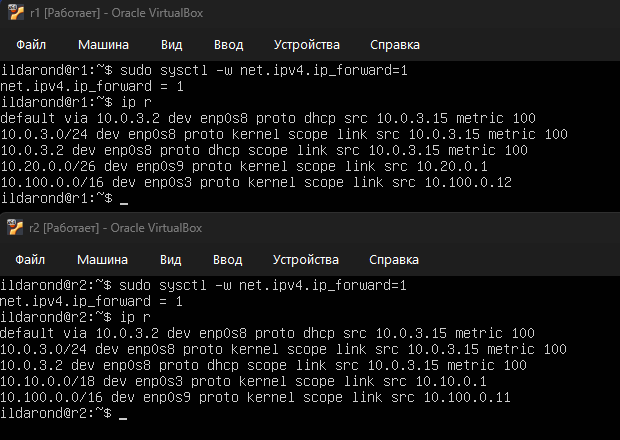


* Откройте файл */etc/sysctl.conf* и добавьте в него следующую строку:
`net.ipv4.ip_forward = 1` 

  При использовании этого подхода, IP-переадресация включена на постоянной основе.*

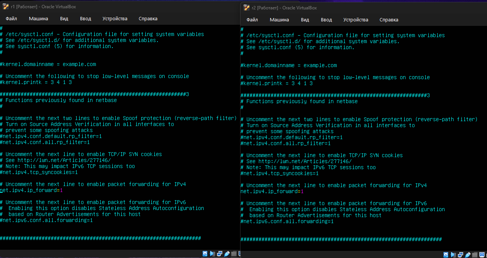

#### 5.3. Установка маршрута по-умолчанию

* Настроить маршрут по-умолчанию (шлюз) для рабочих станций. Для этого добавить `default` перед IP роутера в файле конфигураций

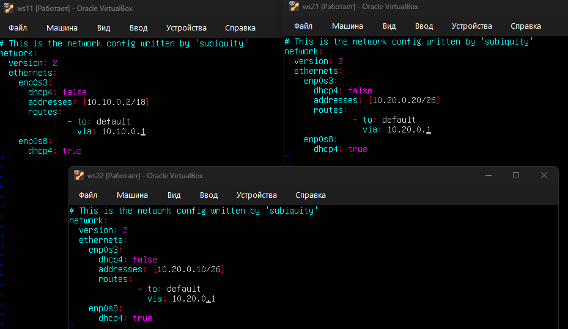

* Вызвать `ip r` и показать, что добавился маршрут в таблицу маршрутизации

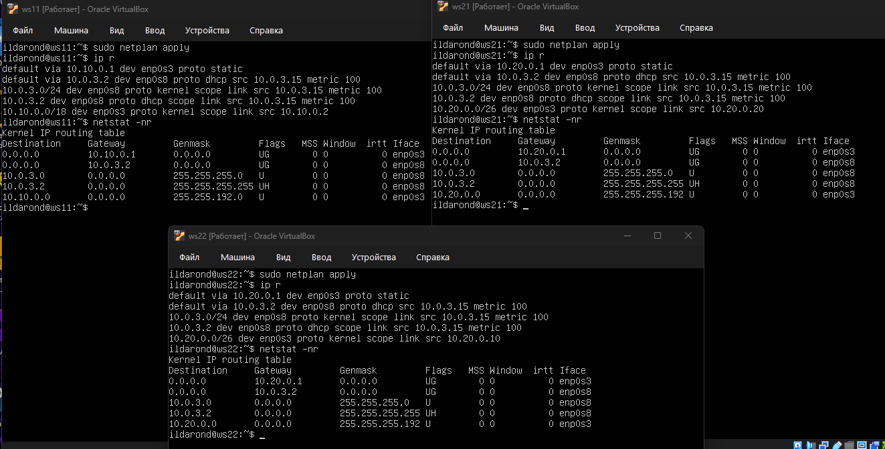

`"proto static"` в выводе команды, это означает, что маршрут был добавлен статически вручную.

Статический маршрут - это маршрут, который администратор сети настраивает вручную, вместо того, чтобы полагаться на протокол маршрутизации, такой как RIP или OSPF, чтобы автоматически определить маршруты и передавать информацию о них другим маршрутизаторам.

* Пропинговать с ws11 роутер r2 и показать на r2, что пинг доходит.

  При помощи команды на r2 `$ sudo tcpdump -tn -i enp0s9` Запускаем утилиту `tcpdump` (позволяет анализировать и отлавливать сетевой трафик), она позволяет прослушать порты и вывести на экран информацию с каких IP адресов приходят пакеты. 
  - `"-tn"` - опции для указания tcpdump о необходимости выводить только числовые IP-адреса вместо имён хостов. Опция "-n" отключает имя хоста, а опция "-t" отключает вывод временных меток.
  - `"-i enp0s9"` - опция для указания tcpdump о необходимости прослушивать сетевой интерфейс с именем "enp0s8". Сетевые интерфейсы могут иметь различные имена в разных системах.

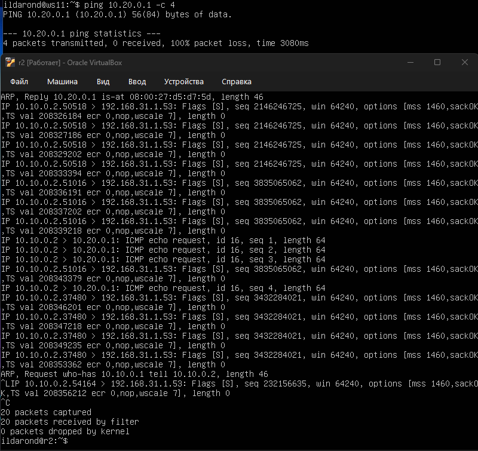

#### 5.4. Добавление статических маршрутов
##### Добавить в роутеры r1 и r2 статические маршруты в файле конфигураций.
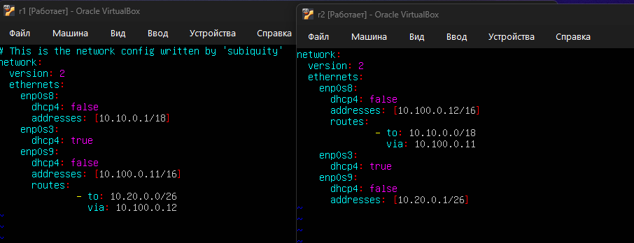

* Вызвать `ip r` и показать таблицы с маршрутами на обоих роутерах.
Cкрин с вызовом и выводом использованной команды:

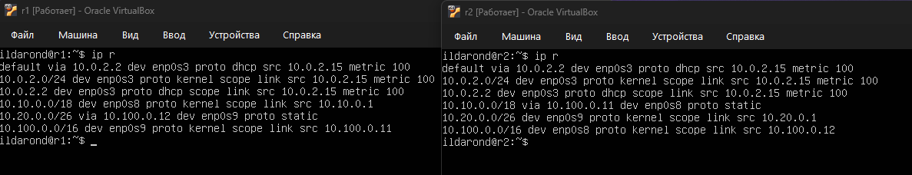

* Запустить команды на ws11:
`ip r list 10.10.0.0/[маска сети]` и `ip r list 0.0.0.0/0`

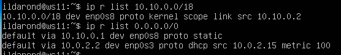

- Объяснить, почему для адреса 10.10.0.0/\[маска сети\] был выбран маршрут, отличный от 0.0.0.0/0, хотя он попадает под маршрут по-умолчанию:

  Маршрут по умолчанию имеет более низкий приоритет и срабатывает, когда не найден подходящий маршрут в таблице маршрутизации. Для сети 10.10.0.0 мы создали правило, соответственно используется созданный маршрут. Также можно устанавливать метрику, чтобы менять приоритеты маршрутов

#### 5.5. Построение списка маршрутизаторов

Команда `traceroute` позволяет узнать, где в данный момент находится пакет, и почему его нельзя доставить по заданному маршруту.

Пример вывода утилиты **traceroute** после добавления шлюза:
```
1 10.10.0.1 0 ms 1 ms 0 ms
2 10.100.0.12 1 ms 0 ms 1 ms
3 10.20.0.10 12 ms 1 ms 3 ms
```
* Запустить на r1 команду дампа
* При помощи утилиты **traceroute** построить список маршрутизаторов на пути от ws11 до ws21

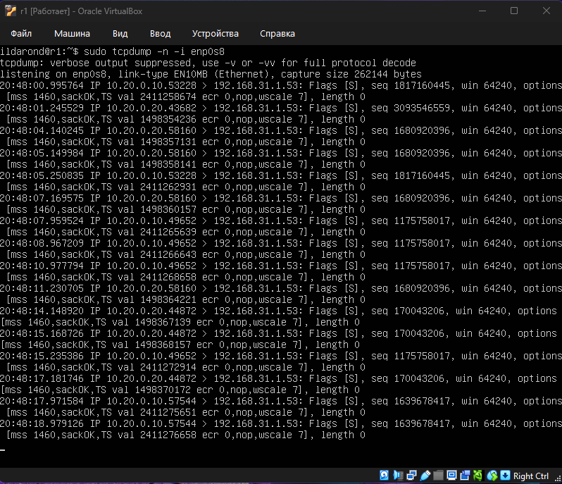

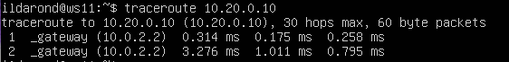

* В отчёте, опираясь на вывод, полученный из дампа на r1, объяснить принцип работы построения пути при помощи **traceroute**:

  Для определения промежуточных маршрутизаторов traceroute отправляет серию пакетов данных целевому узлу, при этом каждый раз увеличивая на 1 значение поля TTL («время жизни»). Это поле обычно указывает максимальное количество маршрутизаторов, которое может быть пройдено пакетом. Первый пакет отправляется с TTL, равным 1, и поэтому первый же маршрутизатор возвращает обратно сообщение ICMP, указывающее на невозможность доставки данных. Traceroute фиксирует адрес маршрутизатора, а также время между отправкой пакета и получением ответа (эти сведения выводятся на монитор компьютера). Затем traceroute повторяет отправку пакета, но уже с TTL, равным 2, что позволяет первому маршрутизатору пропустить пакет дальше.

  Процесс повторяется до тех пор, пока при определённом значении TTL пакет не достигнет целевого узла. При получении ответа от этого узла процесс трассировки считается завершённым.


#### 5.6. Использование протокола **ICMP** при маршрутизации
##### Запустить на r1 перехват сетевого трафика.
##### Пропинговать с ws11 несуществующий IP (например, *10.30.0.111*) с помощью команды:
`ping -c 1 10.30.0.111`

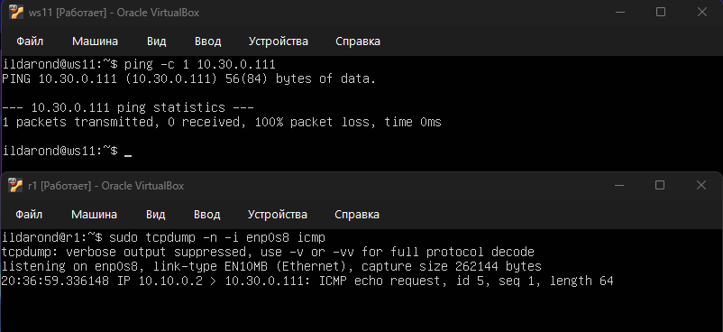

## Part 6. Динамическая настройка IP с помощью **DHCP**

* для начала необходимо скачать isc-dhcp-server: `sudo apt install isc-dhcp-server`

1) Для r2 настроить в файле */etc/dhcp/dhcpd.conf* конфигурацию службы **DHCP**: указать адрес маршрутизатора по-умолчанию, DNS-сервер и адрес внутренней сети.

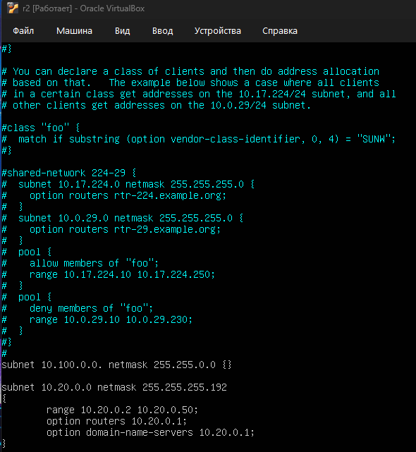

2) в файле *resolv.conf* (`sudo vim /etc/resolv.conf`) прописать `nameserver 8.8.8.8.`

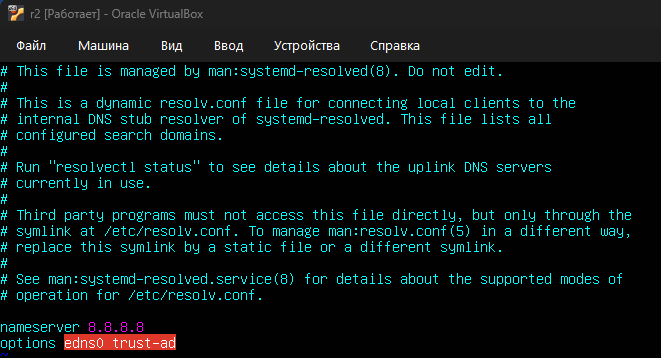

`option edns0 trust-ad`: Эта строка определяет опцию расширения DNS (EDNS) с именем trust-ad. EDNS позволяет клиентам и серверам передавать дополнительную информацию вместе с запросами и ответами DNS. В данном случае, опция trust-ad означает, что клиент и сервер могут доверять аутентификации данных.

3) Перед выполнением следующих пунктов, нам нужно отредактировать `/etc/netplan/00-installer-config.yaml` для включения службы dhcp на ws21 и ws22 и принять изменения `sudo netplan apply`

4) Перезагрузить службу **DHCP** командой `systemctl restart isc-dhcp-server`. Машину ws21 перезагрузить при помощи `reboot` и через `ip a` показать, что она получила адрес. Также пропинговать ws22 с ws21.

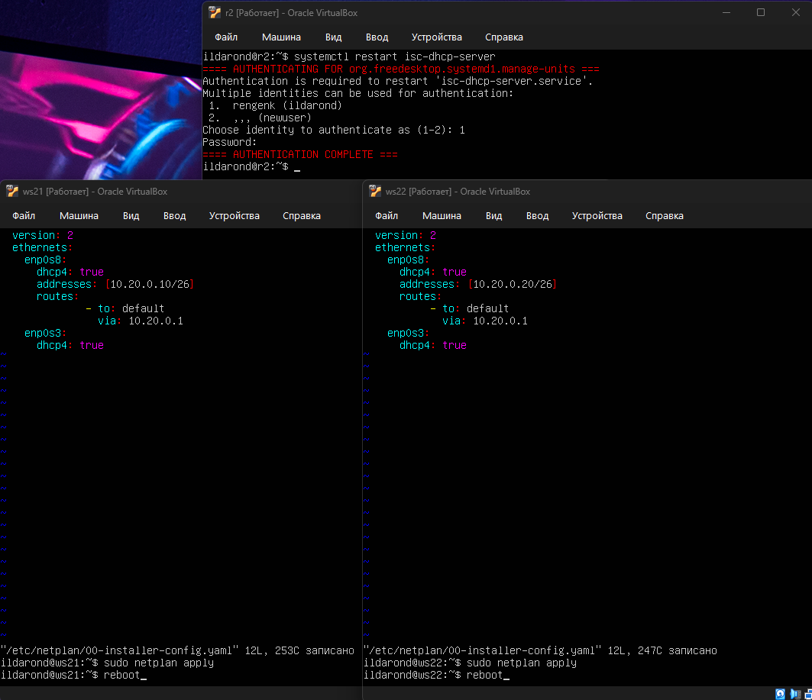

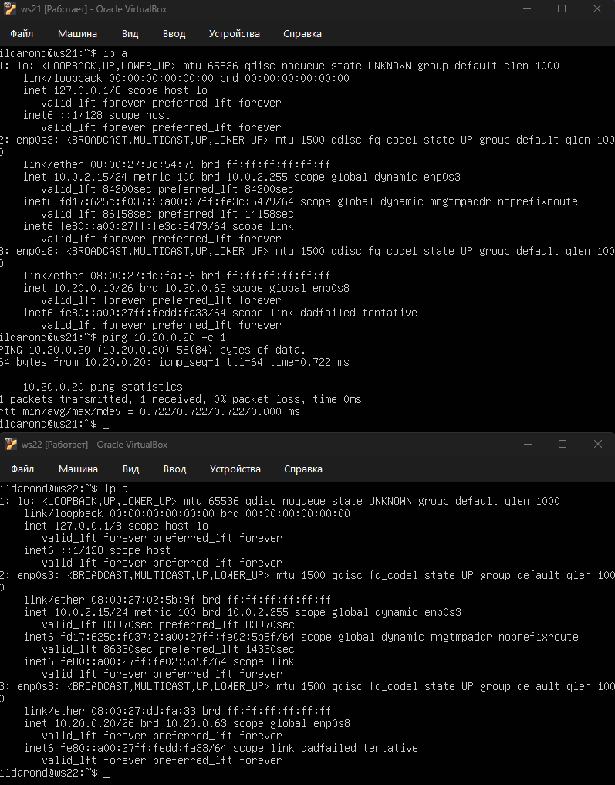

5) Указать MAC адрес у ws11, для этого в *etc/netplan/00-installer-config.yaml* надо добавить строки: `macaddress: 10:10:10:10:10:BA`, `dhcp4: true`

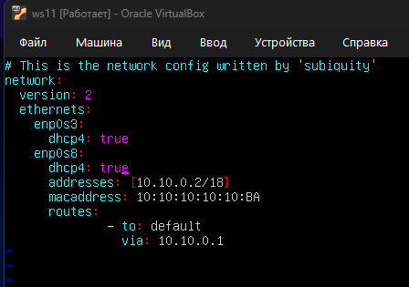

6) Для r1 настроить аналогично r2, но сделать выдачу адресов с жесткой привязкой к MAC-адресу (ws11). Провести аналогичные тесты

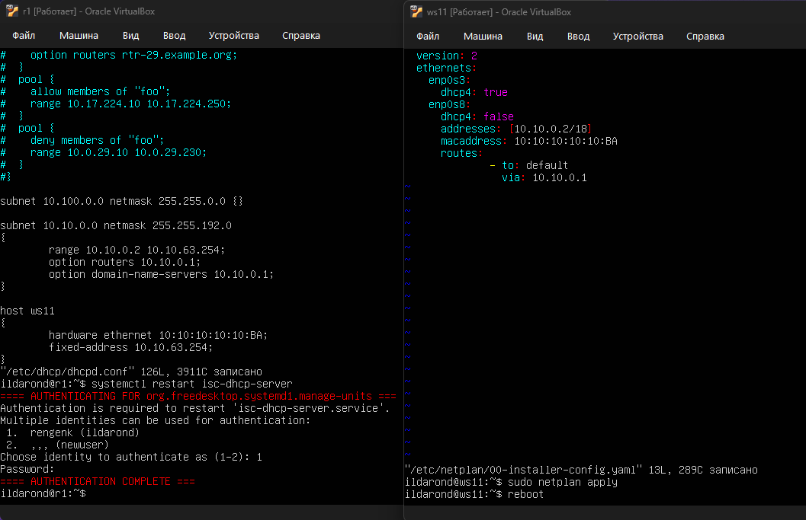


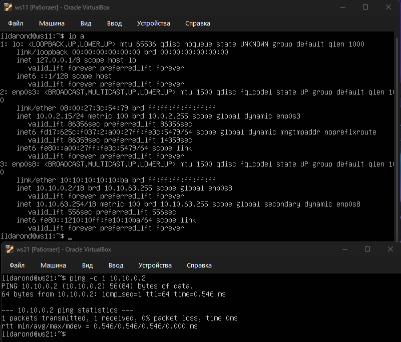

7) Запросить с ws21 обновление ip адреса

Флаг `-r` явно освобождает текущую аренду, и как только аренда будет освобождена, клиент завершает работу.

Например, откройте приложение терминала и введите команду:
* `$ sudo dhclient -r enp0s8` - освободить IP-адрес для конкретного интерфейса
* `$ sudo dhclient enp0s8` - получить новый IP-адрес с помощью DHCP в Linux

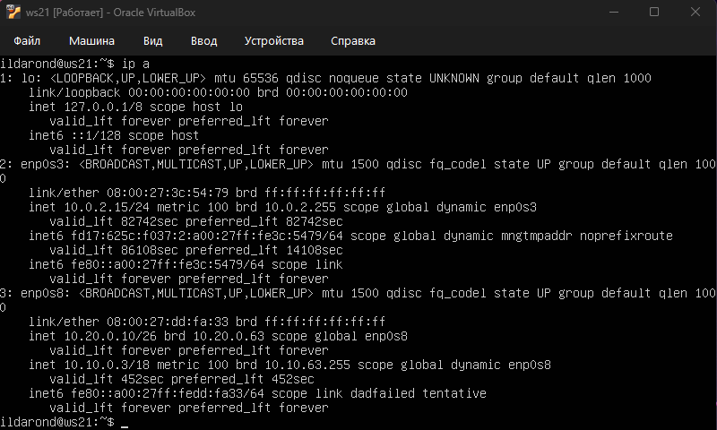

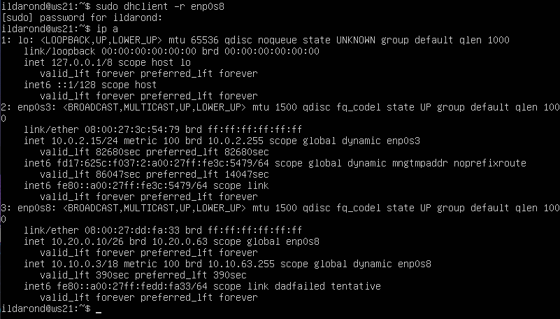

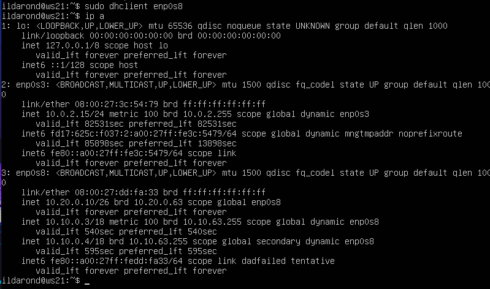

## Part 7. **NAT**

* **Apache HTTP Server** — это бесплатный кроссплатформенный веб-сервер с открытым исходным кодом. Apache состоит из двух основных компонентов: ядра и модулей. Ядро выполняет базовые функции веб-сервера: обрабатывает конфигурационные файлы, выполняет действия, связанные с HTTP, и загружает дополнительные модули.

* `$ sudo apt install apache2` - установка apache2 

**1) В файле */etc/apache2/ports.conf* на ws22 и r1 изменить строку `Listen 80` на `Listen 0.0.0.0:80`, то есть сделать сервер Apache2 общедоступным**

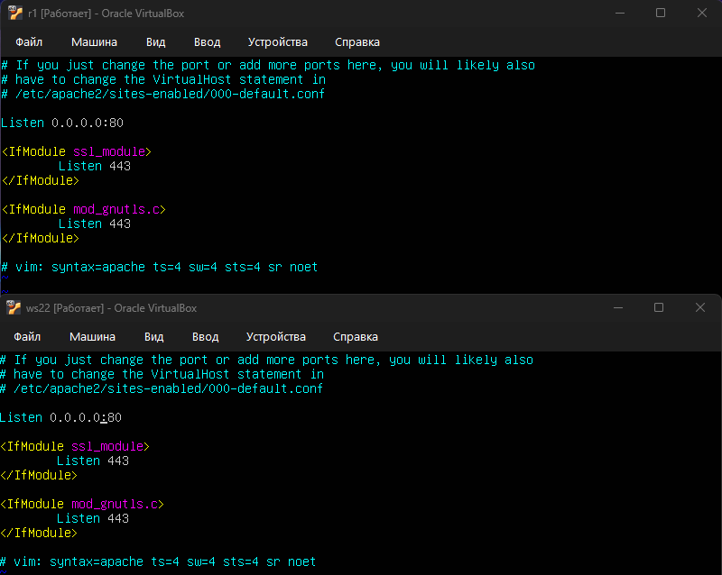


2) Запустить веб-сервер Apache командой `service apache2 start` на ws22 и r1

* `$ systemctl status apache2` - состояние сервера

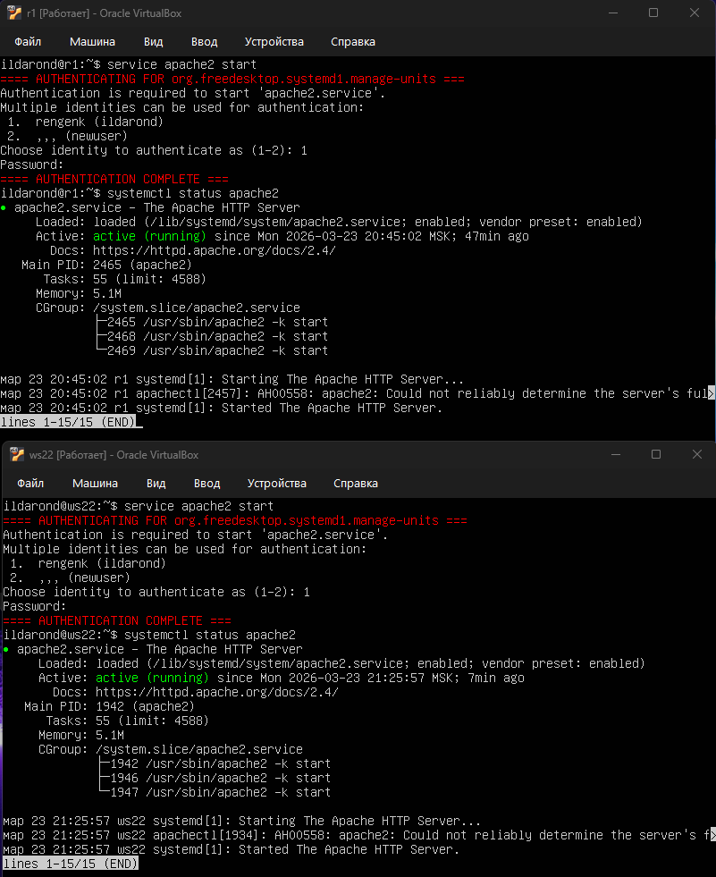

3) Добавить в фаервол, созданный по аналогии с фаерволом из Части 4, на r2 следующие правила:
##### 1) удаление правил в таблице filter - `iptables -F`
##### 2) удаление правил в таблице "NAT" - `iptables -F -t nat`
##### 3) отбрасывать все маршрутизируемые пакеты - `iptables --policy FORWARD DROP`
##### Запускать файл также, как в Части 4
##### Проверить соединение между ws22 и r1 командой `ping`
*При запуске файла с этими правилами, ws22 не должна "пинговаться" с r1*

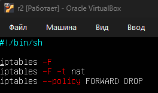

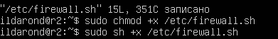

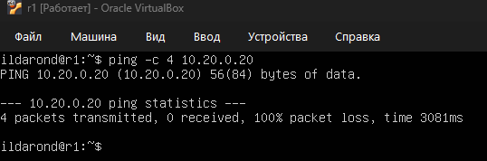

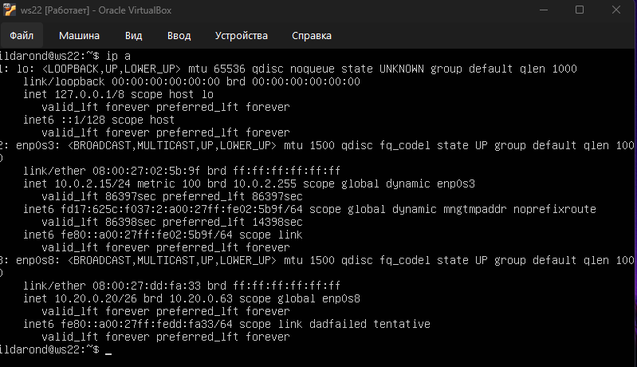

4)  Добавить в файл ещё одно правило:
##### 4) разрешить маршрутизацию всех пакетов протокола **ICMP**
##### Запускать файл также, как в Части 4
##### Проверить соединение между ws22 и r1 командой `ping`
*При запуске файла с этими правилами, ws22 должна "пинговаться" с r1*

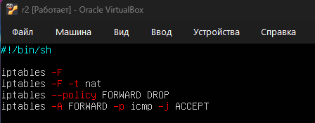

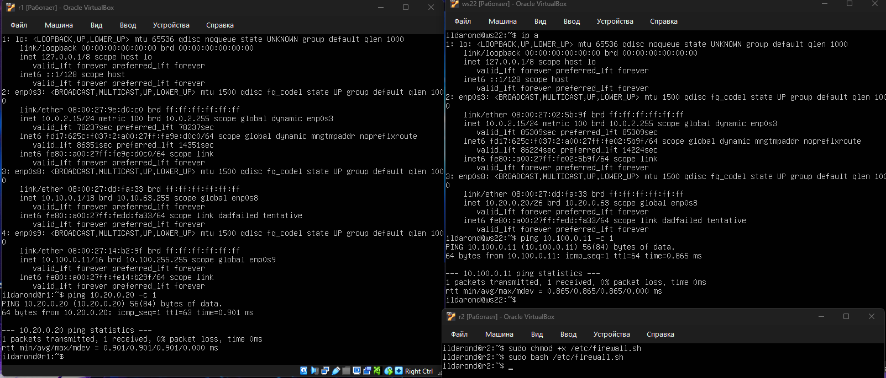

5) Добавить в файл ещё два правила:
##### 5) включить **SNAT**, а именно маскирование всех локальных ip из локальной сети, находящейся за r2 (по обозначениям из Части 5 - сеть 10.20.0.0)
*Совет: стоит подумать о маршрутизации внутренних пакетов, а также внешних пакетов с установленным соединением*

##### 6) включить **DNAT** на 8080 порт машины r2 и добавить к веб-серверу Apache, запущенному на ws22, доступ извне сети
*Совет: стоит учесть, что при попытке подключения возникнет новое tcp-соединение, предназначенное ws22 и 80 порту*


Флаг `-m` используется для указания модуля, который будет использоваться в правиле.

Флаг `--state` указывает на состояние пакета, которое должно быть установлено в правиле. В данном случае, флаг `--state` указывает на установку состояния `ESTABLISHED`, что означает, что пакет находится в состоянии установления соединения.

7) Запускать файл также, как в Части 4
*Перед тестированием рекомендуется отключить сетевой интерфейс **NAT** (его наличие можно проверить командой `ip a`) в VirtualBox, если он включен*

8)  Проверить соединение по TCP для **SNAT**, для этого с ws22 подключиться к серверу Apache на r1 командой: `telnet [адрес] [порт]`

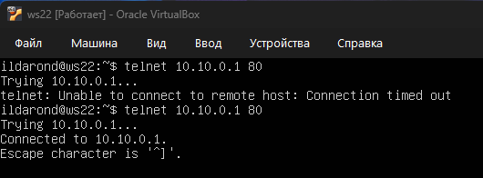

9) Проверить соединение по TCP для **DNAT**, для этого с r1 подключиться к серверу Apache на ws22 командой `telnet` (обращаться по адресу r2 и порту 8080)

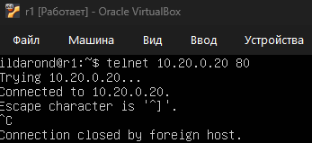

## Part 8. Дополнительно. Знакомство с **SSH Tunnels**

*В данном задании используются виртуальные машины из Части 5*

`Локальная переадресация` используется для перенаправления порта с клиентского компьютера на серверный компьютер. По сути, клиент SSH прослушивает соединения на настроенном порту и, когда он получает соединение, туннелирует его на сервер SSH . 

1) Запустить на r2 фаервол с правилами из Части 7
* запускаем командами `sudo chmod +x /etc/firewall.sh` и `sudo bash /etc/firewall.sh`

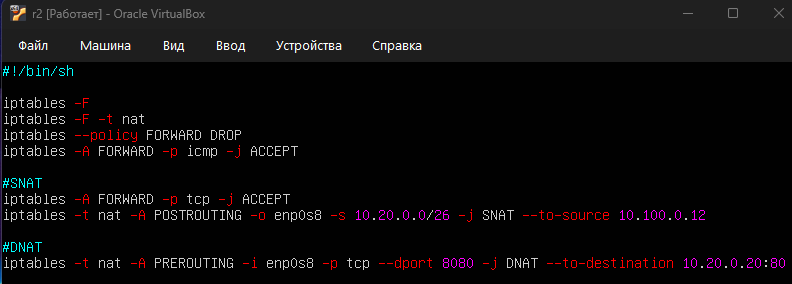

2) Запустить веб-сервер **Apache** на ws22 только на localhost (то есть в файле */etc/apache2/ports.conf* изменить строку `Listen 80` на `Listen localhost:80`)

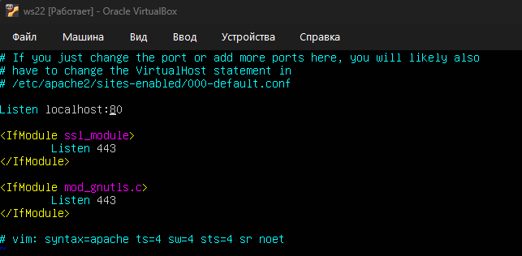

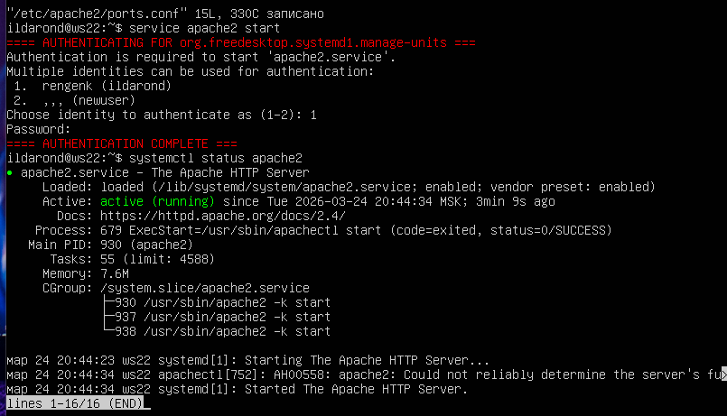

3) Воспользоваться *Local TCP forwarding* с ws21 до ws22, чтобы получить доступ к веб-серверу на ws22 с ws21

* При помощи команды `ssh -L 8080:localhost:80 10.20.0.20` на ws21 устанавливаем соединение с сервером ws22 от машины ws21

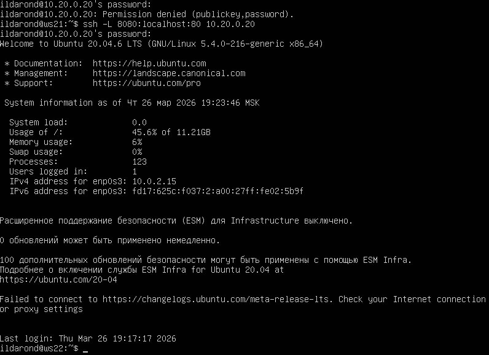


* Для проверки, сработало ли подключение в обоих предыдущих пунктах, перейдите во второй терминал (например, клавишами Alt + F2) и выполните команду:
`telnet 127.0.0.1 [локальный порт]`

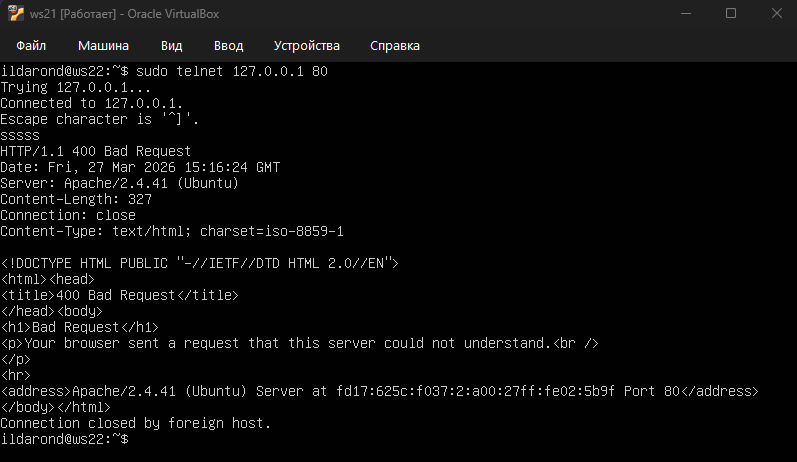

* logout - прервать соединение по ssh тунелю

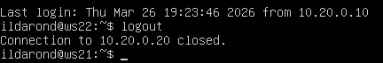

4) Воспользоваться *Remote TCP forwarding* c ws11 до ws22, чтобы получить доступ к веб-серверу на ws22 с ws11

* `ssh -R 7777:localhost:80 10.20.0.20`

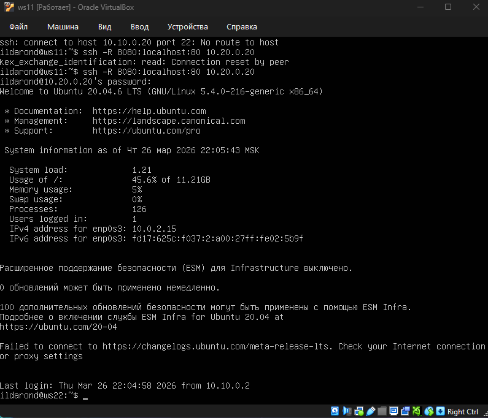

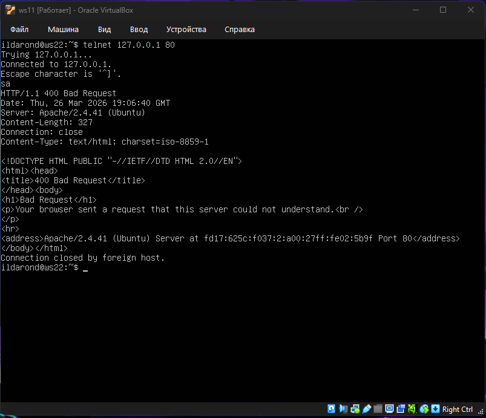